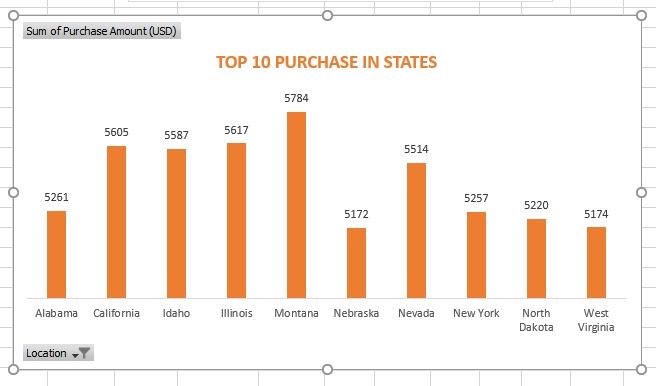
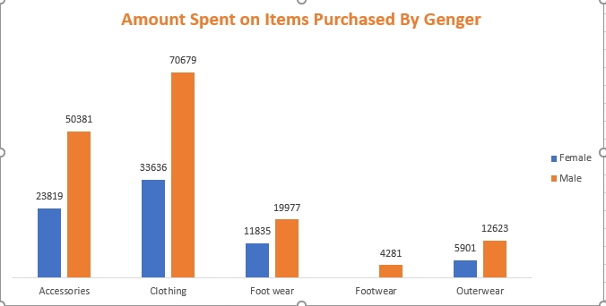
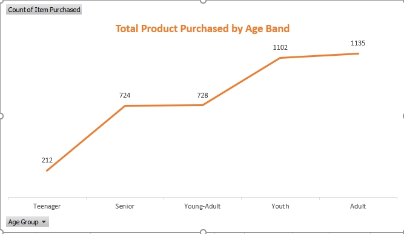
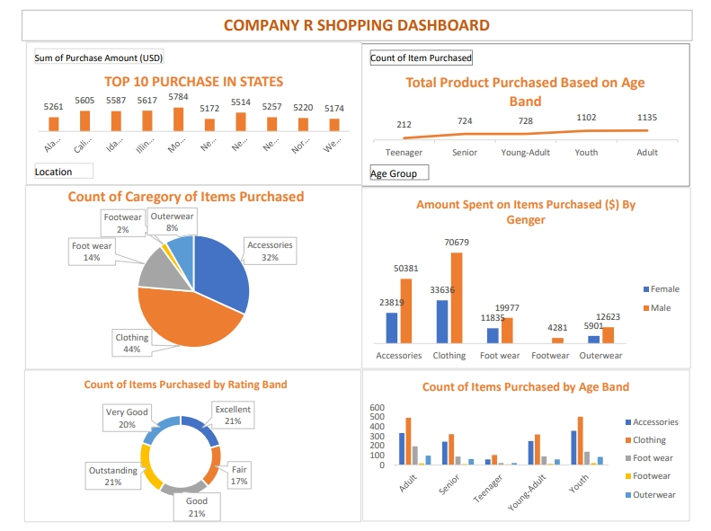

# Shopping-analysis

## Introduction
The report provides an analysis of purchasing behavior for Company R based on data collected from various states in the U.S. The dataset captures consumer preferences across different age groups, gender, product categories, and locations. It highlights the top purchasing states, most popular product categories, and spending trends by gender. Additionally, the report examines customer satisfaction through product ratings.

## Problem-statement
1. Which products have the highest sales?
2. What categories of customers are purchasing these products?
3. How can the shopping mall leverage these trends to increase sales?
4. What strategies can the shopping mall implement to further boost sales?

## Data sourcing
An imaginary shopping data set

## Data Transformation
1. I ensured every field in the dataset was correctly formatted (e.g., data, text, integer, binary).
2. With Excel, I removed duplicates and performed data to prepare the data for analysis.
3. I filtered out rows and columns needed for the analysis.

## Analysis and visualisation
I used Bar chart, pie chart and the rest to visualise the products, the age band, total sales and so on.
It was then discovered that Highest selling product is clothing

## State with most sales

## Amount spent on items by gender

## Total purchase by age band

## Shopping dashboard

## Conclusion
1.	Highest sum of purchases occurred in Montana (5,784), followed by Illinois, California and Idaho, showing geographical purchasing patterns across states.
2.	Most active age groups: youth (1,102 purchases) and adults (1,135 purchases), while teenagers made the fewest purchases (212 purchases).
3.	Clothing dominates as the most purchased category (44%), followed by accessories (32%), with outerwear (8%) and footwear (2%) being the least bought.
4.	Males outspent females in all categories, especially in clothing, where male spending ($70,679) is double that of females ($33,636). However, female spending is higher than male spending in accessories and footwear.
5.	The most frequent ratings are excellent and outstanding, indicating high customer satisfaction. Only 17% of products received a fair rating.
6.	Adults and seniors dominate purchases in accessories and clothing, while younger age groups have a more balanced purchase distribution across all categories.

## Recommendations
1. Targeted marketing for youth and adults, with a focus on products they are more inclined to buy, such as clothing and accessories.
2. Improving product offering for teenagers to boost engagement in this group.
3. Focusing on clothing and accessories since these categories account for the majority of sales, especially among males.
4. Increasing customer satisfaction for lower-rated items to drive higher satisfaction.
5. Implementing gender-specific campaigns to increase engagement and sales.

